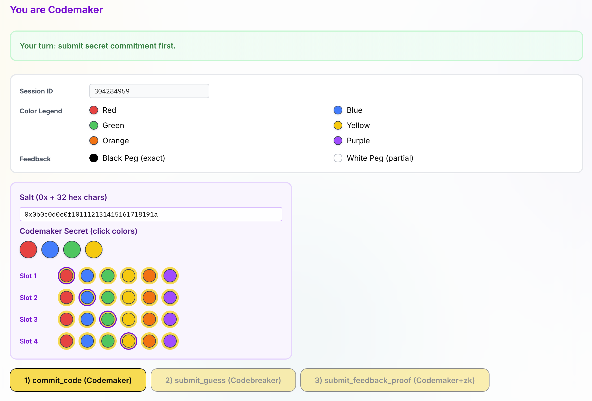
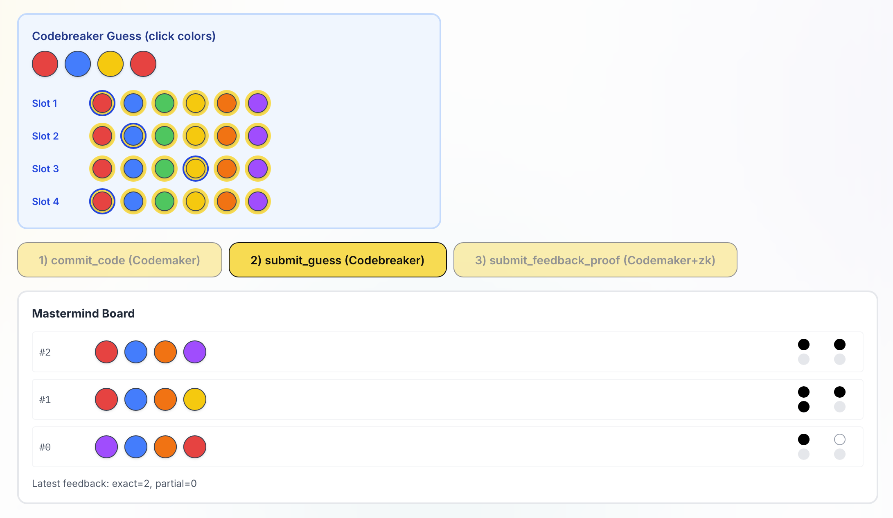
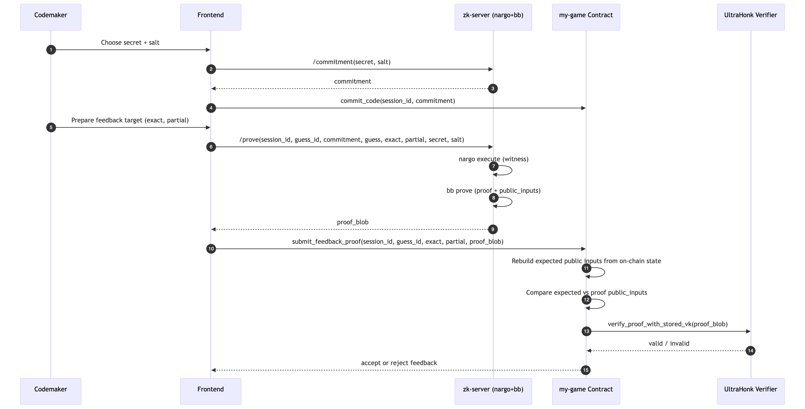

# ZK Mastermind on Stellar
### Trustless feedback proof for Codemaker vs Codebreaker

- Built with Stellar Game Studio
- On-chain game state + zk-verified feedback
- Localnet-ready demo

---

# Problem

Mastermind is: 
- Only Codemaker knows the secret.
- Codebreaker can only guess it.
- Codemaker must give feedback (`exact` / `partial`) without revealing the secret and without lying.

Challenge:
- It is difficult to do it on-chain.
---

# Solution

Using zk for:
- Private secret + trustless anti-lie feedback.

Points:
- Verify that `exact` / `partial` feedback is correct without revealing the answer.
- Codemaker cannot lie about feedback.
- Contract accepts feedback only when:
  - proof public inputs match on-chain game state
  - proof is valid under the stored verification key

---

# Demo UI (Codemaker)

---

# Demo UI (Codebreaker)

---

# Architecture

- `contracts/my-game`: game contract + verifier call
- `contracts/ultrahonk-soroban-contract`: on-chain UltraHonk verifier
- `zk/my-game-circuit`: Noir circuit + VK/proof artifacts
- `my-game-frontend`: auth flow + board UI + runtime proof client
- `my-game-frontend/src/scripts/zk-server.ts`: runtime proving service

---

# Sequence Diagram

---

# End-to-End Flow

1. Auth entry setup (Codemaker -> Codebreaker)
2. `start_game` on-chain
3. Codemaker sets commitment (`commit_code`)
4. Codebreaker submits guess (`submit_guess`)
5. Codemaker proves feedback (`submit_feedback_proof`)
6. Contract updates state / winner / end_game

---

# ZK Public Inputs

Bound public inputs:
- `session_id`
- `guess_id`
- `commitment`
- `guess`
- `exact`
- `partial`

Proof is accepted only if:
- inputs match on-chain state
- verifier validates proof with stored VK

---

# Security Notes

- Secret is never posted on-chain.
- Commitment is salted and one-way.
- Invalid/tampered proofs are rejected.
- Wrong feedback claims fail proving/verification.
- Contract enforces round limit and role-based actions.
